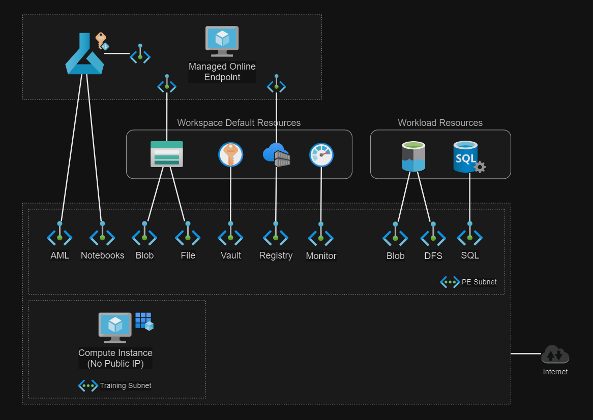

# Azure ML VNET

Implementation of [AML network isolation][1] with a customer-managed VNET.



## Setup

Create the variables file:

```sh
cp config/template.tfvars .auto.tfvars
```

👉 Set your IP address in the `allowed_ip_address` variable.

Generate a key pair to manage instances with SSH:

```sh
ssh-keygen -f keys/ssh_key
```

Create the resources:

```sh
terraform init
terraform apply -auto-approve
```

Confirm and approve any private endpoints, both in the subscription, and within the managed AML workspace.

Add the datastores and run the test notebooks.

---

### Clean-up

Delete the resources and avoid unplanned costs:

```sh
terraform destroy -auto-approve
```

[1]: https://learn.microsoft.com/en-us/azure/machine-learning/how-to-network-isolation-planning?view=azureml-api-2#recommended-architecture-use-your-azure-vnet
