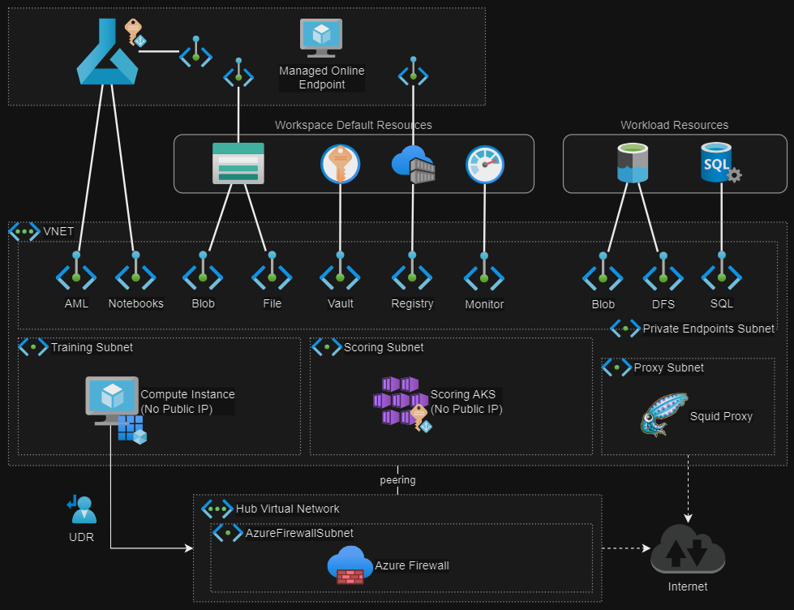

# Azure ML VNET

Implementation of [AML network isolation][1] with a customer-managed VNET.



## Setup

Create the variables file:

```sh
cp config/template.tfvars .auto.tfvars
```

Configuration:

1. Set your IP address in the `allowed_ip_address` variable.
2. Set your the Entra ID tenant in the  `entraid_tenant_domain` variable.

Generate a key pair to manage instances with SSH:

```sh
ssh-keygen -f keys/ssh_key
```

Create the resources:

```sh
terraform init
terraform apply -auto-approve
```

Confirm and approve any private endpoints, both in the subscription, and within the managed AML workspace.

Manually create the datastores in AML and run the test notebooks.

## Compute

Create the AML compute and other resources by changing the appropriate flags:

> [!NOTE]
> Follow the [documentation][2] steps to enable AKS VNET integration, if not yet done so.

```terraform
mlw_instance_create_flag = true
mlw_aks_create_flag      = true
mlw_mssql_create_flag    = true
```

## Container Registry

Extra configuration is required when using an Container Registry with private endpoints.

After creating the compute node, follow the [documentation][6] to enable docker builds in AML:

```sh
az ml workspace update --name myworkspace --resource-group myresourcegroup --image-build-compute mycomputecluster
```

## IAM

This project has two roles which require different set of permissions:

| User | Activities |
|------|------------|
| `azureadmin` | Administration of all related Azure resources. |
| `datascientist` | Development in the AML workspace. |

## Firewall

To demonstrate protection against data exfiltration, this exercise implements Azure Firewall. The requirements for this design are documented in this [Configure inbound and outbound network traffic][8] article.

> [!IMPORTANT]
> Additional steps for hardening the data exfiltration protection are available in the [Azure Machine Learning data exfiltration prevention][9] documentation.


Set the flag to enable the Azure Firewall resources and `apply` the infrastructure:

```terraform
firewall_create_flag = true
```

This will create the firewall, policies, rules, routes, and other resources.

> [!TIP]
> It's also possible to get a list of hosts and ports, following this [guideline][10].

## Forward Proxy

> [!CAUTION]
> It was not possible to configure a forward proxy on instance creation (with a creation script) when deploying to an isolated Virtual Network. It seems that the provisioning procedure is overriding the proxy configuration from the startup script. The only official architecture supported by Microsoft with network isolation seems to be using a Firewall for egress. 

### Enable Proxy

Set the proxy flag to `true`:

```terraform
vm_proxy_create_flag = true
```

Configure the compute instance with sample file [custom/instance-proxy-init.sh](./custom/instance-proxy-init.sh).

Proxy connection will be configured on init following the [proxy documentation][7].


### Squid

Connect to the proxy VM server:

```sh
ssh -i keys/ssh_key azureuser@<public-ip>
```

Squid will already be installed via `cloud-init`. If you need to make changes, check the [official docs][5].

Configuration can be set in file `/etc/squid/squid.conf`.

Set some hostname parameters:

```
visible_hostname squid.private.litware.com
hostname_aliases squid.private.litware.com
```

Change the `http_access` setting to allow all connections:

```
# http_access deny !Safe_ports
http_access allow all
```

Restart the service:

```sh
sudo systemctl restart squid.service
```

Testing with default configuration:

```sh
curl -x "http://squid.private.litware.com:3128" "https://example.com/"
```

### NGINX

> [!NOTE]
> From this [thread][4], running NGINX full proxy with HTTPS will required additional configuration steps.

Connect to the proxy server:

```sh
ssh -i keys/ssh_key azureuser@<public-ip>
```

I've used [this article][3] as reference to setup the forward proxy server on NGINX.

1. Comment the default server config within `/etc/nginx/sites-enabled/default`.
2. Create the [nginx/forward][nginx/forward] config file.
3. Restart NGINX (`systemctl restart nginx.service`).

The forward proxy service should be available at port `8888`.

```sh
curl -x "http://127.0.0.1:8888" "https://example.com/"
```

---

### Clean-up

Delete the resources and avoid unplanned costs:

```sh
terraform destroy -auto-approve
```

[1]: https://learn.microsoft.com/en-us/azure/machine-learning/how-to-network-isolation-planning?view=azureml-api-2#recommended-architecture-use-your-azure-vnet
[2]: https://learn.microsoft.com/en-us/azure/aks/api-server-vnet-integration
[3]: https://www.baeldung.com/nginx-forward-proxy
[4]: https://serverfault.com/a/1090581/560797
[5]: https://ubuntu.com/server/docs/how-to-install-a-squid-server
[6]: https://docs.microsoft.com/azure/machine-learning/how-to-secure-workspace-vnet#enable-azure-container-registry-acr
[7]: https://learn.microsoft.com/en-us/azure/machine-learning/how-to-secure-workspace-vnet?view=azureml-api-2&tabs=required%2Cpe%2Ccli#required-public-internet-access
[8]: https://learn.microsoft.com/en-us/azure/machine-learning/how-to-access-azureml-behind-firewall?view=azureml-api-2&tabs=ipaddress%2Cpublic
[9]: https://learn.microsoft.com/en-us/azure/machine-learning/how-to-prevent-data-loss-exfiltration?view=azureml-api-2&tabs=servicetag
[10]: https://learn.microsoft.com/en-us/azure/machine-learning/how-to-access-azureml-behind-firewall?view=azureml-api-2&tabs=ipaddress%2Cpublic#dependencies-api
